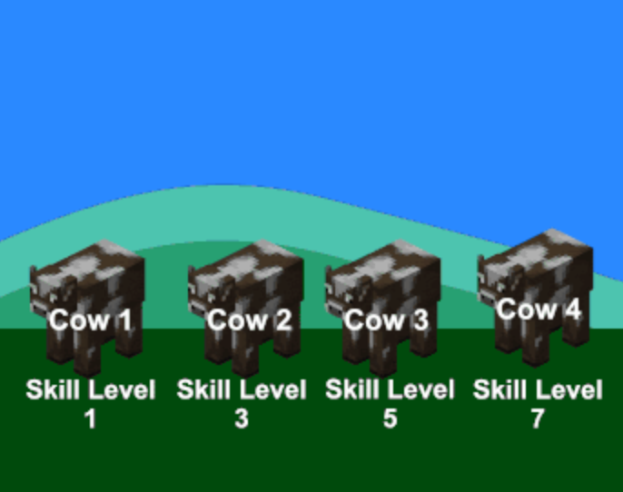
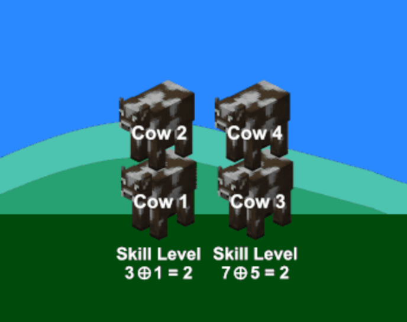
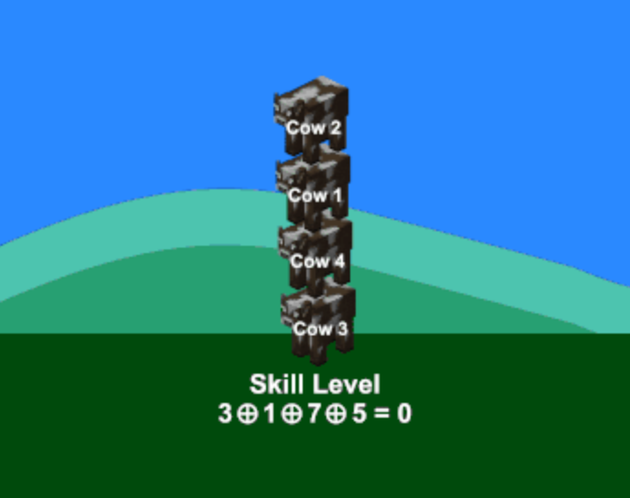

# ☁️体验

当天时间记错了，晚上刚打完牛客周赛，然后发现 div.4 和牛客周赛居然是同一天，有点猝不及防。

没什么状态，但是想上大分，便硬上了，表现不佳。

难度方面的话，这场的题多数都比较简单。

不过，H 怎么感觉出成 div. 2 的 F 了，2400？ 

险些坠机，小上分。

# 💡题解

## A - Perfect Root 

### 题意

给你一个正整数数 $n$，输出 $n$ 个不一样的完全平方根。

比如，$2 = \sqrt{4}$，那么 $2$ 就是完全平方根。

### 思路

很明显，所有的正整数都是完全平方根。

那么输出 $1$ 到 $n$ 即可。

> 有趣的是，我赛时题目看错了，以为要输出 $n$ 个不同的完全平方数，却恰好也满足题意。

### 我的赛时代码

```cpp
void solve()
{
    int n; 
    cin >> n;

    for(int i = 1; i <= n; i++)
        cout << i * i << " \n"[i == n];
}

```

## B - Prefix Max

### 题意

给你一个长度为 $n$ 的正整数数组 $a$。

你有**最多**一次交换任意两个元素位置的机会。

设前缀最大值数组为 $pre[i] = max(a[0], \dots, s[i])$

问前缀最大值数组之和最大是多少。

### 思路

我们要让每个前缀最大值尽可能大，尽可能接近 $a$ 的最大值 $max(a)$。

因为，前缀最大值是非单调递减的。

所以不难想到，我们把 $max(a)$ 和 $a[0]$ 交换即可。

另外，由于是 "**最多**一次"，如果 $max(a)$ 刚好就在第一个位置，我们可以选择不换。

因此，最后答案就是 $max(a) \times n$。

### 代码

```cpp
void solve()
{
    input(n, a);
    D(*max_element(all(a)) * n);
}
```

## C - Shifted MEX

### 题意

给你一个长度为 $n$ 的数组 $a$。

你可以进行一次操作，把 $a$ 中的所有元素加上一个数 $x$。

问 $mex(a)$ 的最大值是多少。

### 思路

我们把这些元素都标到一条数轴上。

你会发现，题目要求的 $mex(a)$ 其实就是从 $0$ 开始的连续点段中断开的位置。而 $+ x$ 这个操作，其实就是把所有的点左右平移。任何连续的点段都可以是从 $0$ 开始的。

那么，问题就转化成了，求出最长的连续点段有多长。

我们只需要知道某个位置有没有点就行了，重复的元素是不需要的，所以我们可以用一个集合去重。

然后，滑动窗口遍历集合筛选出来的数组，维护长度最大值即可。

### 代码

```cpp
void solve()
{
    int n; 
    cin >> n;

    set<int> s;
    for(int i = 0; i < n; i++) 
    {
        int x; 
        cin >> x;
        s.insert(x);
    }

    if(s.size() == 1)
    {
        D(1);
        return;
    }

    vector<int> a(all(s));

    int l = 0, r = 1, m = a.size(), ans = 1;
    for( ; r < m; r++)
        if(a[r - 1] + 1 != a[r]) 
        {
            ans = max(ans, r - l);
            l = r;
        }
    ans = max(ans, r - l);

    D(ans);
}

```

## D - OutOfMemoryError

### 题意

给你一个长度为 $n$ 的数组 $a$ 和 $m$ 个操作。

每个操作是一个二元组 $(x, y)$，表示把第 $x$ 个元素加上 $y$。

每次操作后，如果 $a[x]$ 超过了 $h$，那么整个数组就会回到最初的状态。

要求打印数组最后的状态。

### 思路

这题有坑，纯暴力模拟会超时。

设想一下，如果每次都会超过 $h$，那么我们每次都要把每个元素挨个挨个地复原，这样的复杂度是 $O(nm)$，无法通过这题。

显然，每次需要复原的时候，并不是每个元素都被改动过。很多元素从头到尾都还是原来的样子，复原操作对它们而言没有意义。正是这个地方，耗费了大量的时间，导致了 TLE。

所以，我们只需要记录每次操作对哪些元素有影响，然后只对这些元素进行复原操作即可。

具体来说，我们用一个 map 记录每个元素的增量。

每次操作时，我们只需要把第 $x$ 个元素的增量加上 $y$ 即可。

如果第 $x$ 个元素的增量加上 $y$ 后超过了 $h$，那么我们就清空 map。

最后，我们只需要把每个元素的增量加到对应的元素上即可。

这样，我们就只需要遍历一次操作，每次操作的复杂度是 $O(\log m)$，最后总复杂度是 $O(m \log m)$。

### 代码

```cpp
void solve()
{
    int n, m, h; 
    cin >> n >> m >> h;

    vector<int> a(n); 
    vcin(a);

    vector<pair<int, int>> b(m);
    for(auto& [x, y] : b) 
        cin >> x >> y;

    map<int, int> d;
        
    for(auto& [x, y] : b) 
    {
        d[x - 1] += y;
        
        if(a[x] + d[x] > h) 
            d.clear();
    }

    for(auto& [x, y] : d)
        a[x] += y;
        
    vD(a);
}

```

## E - The Robotic Rush

### 题意

给你 $n$ 个机器人的位置和 $m$ 个死亡点，接下来对所有的机器人同时发出 $k$ 条指令。

每条指令是一个字符，'$L$' 表示向左移动一格，'$R$' 表示向右移动一格。

机器人在移动时，如果移动到了死亡点，那么机器人就会死亡。

问每次指令后，还有多少机器人存活。

### 思路

纯模拟肯定超时，我们来讲讲如何优化。

先来浅浅分析一下：

- 每个机器人的死亡只与左右两边最近的死亡点有关；

- 每个机器人在同一时刻的偏移量是一样的。

那么就好办了。

我们用 $x$ 来表示所有机器人的偏移量。

再用一个 $map$ 来记录偏移量为 $x$ 时，哪些位置的机器人会死亡。

然后预先算出每个机器人的左右两边最近的死亡点距离它们自身位置的偏移量，然后按照偏移量把它们存到 $map$ 里。

再用一个 $set$ 来记录已经死亡的机器人，防止重复判定死亡。


最后，遍历指令，每次执行指令时，我们只需要看偏移量为 $x$ 时会死亡的机器人，然后判断是否死亡，并从 $map$ 移除。随后，更新答案并输出。

### 代码

```cpp
void solve() 
{
    int n, m, k; 
    cin >> n >> m >> k;

    vector<int> a(n), b(m); 
    vcin(a); 
    vcin(b);

    string s; 
    cin >> s;

    set<int> die;
    map<int, set<int>> dx;

    sort(all(b));
        
    for(int& i  : a) 
    {
        if(b[0] < i)
        {
            int dl = *(lower_bound(all(b), i) - 1) - i;
            dx[dl].insert(i);
        }
        if(i < b[m - 1])
        {
            int dr = *(lower_bound(all(b), i)) - i;
            dx[dr].insert(i);
        }
    }

    int ans = n, x = 0;
    for(char& c : s)
    {
        x += c == 'L' ? -1 : 1;

        vector<int> e;

        for(int i : dx[x])
        {
            e.push_back(i);
            if(die.insert(i).second) 
                ans--;
        }

        for(int& i : e)
            dx[x].erase(i);

        cout << ans << ' ';
    }

    cout << endl;
}

```

## F - BattleCows

### 题意

给你一个长度为 $2^n$ 的数组 $a$，代表 $2^n$ 头牛，每头牛的战斗力为 $a_i$。

每次战斗，奇数位置的牛会和偶数位置的牛战斗，输的牛会被赢的牛踩在脚下。然后，这堆牛的共同战斗力会变成这两头牛的战斗力的异或和。

如果两头牛的战斗力相同，判奇数位置赢。

最后所有的牛都会叠在一堆。

就像下面这样：







接下来，你会得到 $q$ 个询问，每个询问是一个二元组 $(p, x)$，表示把第 $p$ 头牛的战斗力改为 $x$。

每次询问后，你需要输出第 $p$ 头牛的头上有多少头牛。

### 思路

这道题考察的是一个线段树建模的思想。

我们可以把这堆牛看成一个线段树，每个节点代表一堆牛。

先正常左右递归建树，然后把每个节点的战斗力设为左右子节点的战斗力的异或和。

然后，在单点更新这里稍微加点东西。

我们在往上递归的时候，其实就是在模拟第 $p$ 头牛的战斗过程。

赢的一边会把输的一边踩在下面。

我们头上有几头牛，说白了，和我们的当前排名差不多。

- 如果我们赢了，我们的当前排名就不变，$ans$ 就不变。

- 如果我们输了，另一边的牛就会全部跑到我们头上，$ans$ 就会加上另一边的牛的数量。

牛的数量我们可以通过线段树的区间长度来计算。

- 左边的牛的数量就是 $mid - l + 1$；
- 右边的牛的数量就是 $r - mid$；

所以，我们在更新的时候，只需要判断左右子节点的战斗力谁大，然后加上对应的数量返回 $ans$ 即可。

最后声明一下，由于 $ans$ 初始化是 $0$，代表的意义是头上有多少牛，并不是实际排名，上述的排名的引入只是为了便于理解，所以我们不需要把 $update()$ 的返回值减 $1$。

### 代码

```cpp
void solve()
{
    int n, q; 
    cin >> n >> q;

    vector<int> a(1 << n), t((1 << n) << 2); 
    vcin(a);

    auto build = [&](this auto&& build, int x, int l, int r) -> void 
    {
        if(l == r) { t[x] = a[l]; return; }
        int mid = (l + r) >> 1;
        build(x << 1, l, mid);
        build(x << 1 | 1, mid + 1, r);
        t[x] = t[x << 1] ^ t[x << 1 | 1];
    };

    auto update = [&](this auto&& update, int x, int l, int r, int pos, int val) -> int
    {
        if(l == r) { t[x] = val; return 0; }
        int mid = (l + r) >> 1, ans = 0;
        bool left = pos <= mid ? true : false;
        if(left) ans += update(x << 1, l, mid, pos, val);
        else ans += update(x << 1 | 1, mid + 1, r, pos, val);
        t[x] = t[x << 1] ^ t[x << 1 | 1];
        if(t[x << 1] >= t[x << 1 | 1]) ans += left ? 0 : (mid - l + 1);
        else ans += left ? (r - mid) : 0;
        return ans;
    };

    build(1, 0, (1 << n) - 1);
        
    while(q--) 
    {
        int p, x; 
        cin >> p >> x;
        D(update(1, 0, (1 << n) - 1, p - 1, x));
        update(1, 0, (1 << n) - 1, p - 1, a[p - 1]);
    }
}
```

## G - Mixing MEXes

### 题意

给你 $n$ 个长度为 $l_i$ 的数组 $a_i$。

你可以从数组 $a_i$ 中选择一个元素 $a_{i,j}$，然后把 $a_{i,j}$ 移到另一个数组中。

每种方案的值 $val = \sum_{i=1}^n mex(a_i)$。

问所有方案加起来的值 $\sum val$ 是多少。

### 思路

这题可以可以使用贡献法来解决。

如果所有的方案都什么都不做，我们设答案为 $ans$。

然后再来看，对于任意一次移动，对答案产生的贡献：

- 从 $a_i$ 中移除 $x$
  
  - 如果 $x < mex(a_i)$ 并且 $a_i$ 中只有一个 $x$，那么 $mex(a_i)$ 会变成 $x$
    
    - 贡献为 $x - mex(a_i)$

  - 否则，对 $mex(a_i)$ 没有影响

    - 贡献为 $0$

- 把 $x$ 加到另一个数组中

  - 如果 $x = mex(a_j)$，那么 $mex(a_j)$ 会变成下一个 $mex(a_j)$，我们记作 $mex(a_j)^{'}$

    - 贡献为 $mex(a_j)^{'} - mex(a_j)$

  - 否则，对 $mex(a_j)$ 没有影响

    - 贡献为 $0$

统计所有数组的元素数量，记为 $cnt = \sum_{i=1}^n l_i$。

很明显，对于任意一个元素，都可以移到其他 $n - 1$ 个数组中。

所以总方案数就是 $cnt \times (n - 1)$。

那么答案初始为 $ans = cnt \times (n - 1) \times \sum_{i=1}^n mex(a_i)$。

移走产生贡献：

- 每次贡献值为 $x - mex(a_i)$

- 可以移到其他 $n - 1$ 个数组中

所以是 $(x - mex(a_i)) \times (n - 1)$。

移入产生贡献：

- 每次贡献值为 $mex(a_j)^{'} - mex(a_j)$

- 一共有 $f(mex(a_j))$ 个 $mex(a_j)$。显然，全场所有的 $mex(a_j)$ 都属于其他数组。

所以是 $f(mex(a_j)) \times (mex(a_j)^{'} - mex(a_j))$。

把这些贡献加到 $ans$ 里面就是最终答案了。

### 代码

```cpp
void solve()
{
    int n; 
    cin >> n;

    vector<map<int, int>> a(n);
    int cnt = 0;
    map<int, int> f;
    for(auto& mp : a)
    {
        int l; 
        cin >> l;
        cnt += l;
        while(l--)
        {
            int x; 
            cin >> x;
            mp[x]++;
            f[x]++;
        }
    }

    vector<array<int, 2>> mex(n);
    for(int i = 0; i < n; i++)
    {
        for(auto& [k, v] : a[i])
        {
            if(k > mex[i][0]) break;
            if(k == mex[i][0]) mex[i][0]++;
        }
        mex[i][1] = mex[i][0] + 1;
        for(auto& [k, v] : a[i])
        {
            if(k > mex[i][1]) break;
            if(k == mex[i][1]) mex[i][1]++;
        }
    }

    int sum = 0;
    for(int i = 0; i < n; i++)
        sum += mex[i][0];
        
    int ans = cnt * (n - 1) * sum;
        
    for(int i = 0; i < n; i++)
        for(auto& [k, v] : a[i])
            if(v == 1 && k < mex[i][0]) 
                ans += (k - mex[i][0]) * (n - 1);
        
    for(int i = 0; i < n; i++)
        ans += f[mex[i][0]] * (mex[i][1] - mex[i][0]);

    D(ans);
}
```

## H - BattleCows 2

待更新

# 🎈模板

## 火车头

```cpp
#include <bits/stdc++.h>
#define inf INT_MAX
#define INF LLONG_MAX
#define MOD 1000000007
#define mod 998244353
#define all(_x) _x.begin(), _x.end()
#define vcin(_x) for(auto& _i : _x) cin >> _i
#define vvcin(_x) for(auto& _j : _x) for(auto& _i : _j) cin >> _i
#define D(_x) cout << _x << endl
#define vD(_x) for(int _i = 0; _i < _x.size(); ++_i) cout << _x[_i] << " \n"[_i == _x.size() - 1]
#define input(_n, _a) int _n; cin >> _n; vector<int> _a(_n); vcin(_a)
#define flr(_i, _l, _r) for(int _i = _l; _i <= _r; ++_i)
#define frl(_i, _r, _l) for(int _i = _r; _i >= _l; --_i)
#define YES cout << "YES" << endl
#define NO cout << "NO" << endl
#define Yes cout << "Yes" << endl
#define No cout << "No" << endl
#define yes cout << "yes" << endl
#define no cout << "no" << endl
using namespace std;

#define int long long
#define endl '\n' 

void solve()
{
    
}

signed main()
{
    ios::sync_with_stdio(false);
    cin.tie(nullptr);
    int _ = 1;
cin >> _;
    while (_--)
        solve();
    return 0;
}
```
